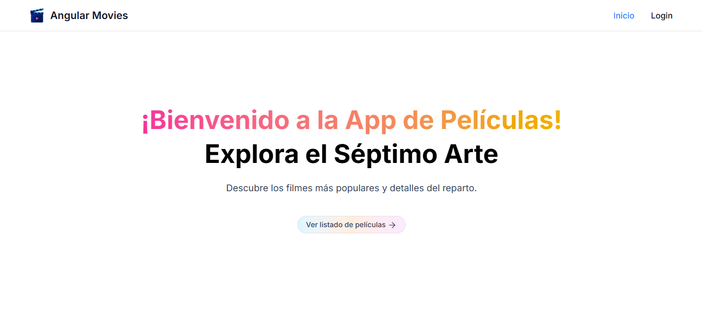
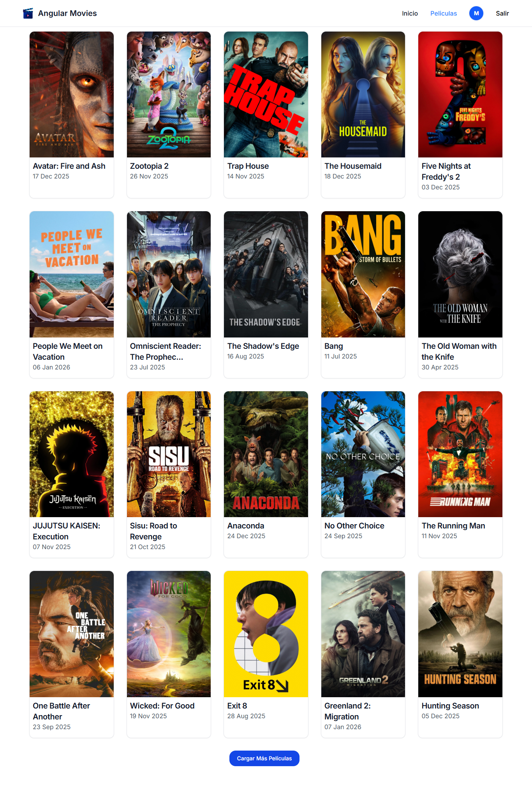

# 🎬 Angular Movies 2026

¡Bienvenido a **Angular Movies**! Una aplicación moderna de catálogo de películas construida con **Angular 20**. Esta aplicación permite explorar los estrenos actuales, consultar detalles técnicos del reparto y gestionar la autenticación de usuarios mediante Firebase.





## 🌐 Tecnologías Utilizadas
- **Angular 20** (Core Framework)  
- **Firebase Auth** (Autenticación)  
- **Tailwind CSS** (Estilos)  
- **Flowbite** (Componentes UI)  
- **RxJS** (Programación Reactiva)  
- **Jasmine/Karma** (Testing)  

## 🚀 Características Principales

- **Angular 20 Standalone Architecture:** Componentes 100% independientes sin módulos innecesarios.
- **Reactive State con Signals:** Uso intensivo de `signal`, `computed`, `effect` y `toSignal` para una reactividad óptima.
- **Autenticación con Firebase:** Flujo completo de registro y login con manejo de errores.
- **Integración con TMDB API:** Consumo de datos en tiempo real de [The Movie Database](www.themoviedb.org).
- **Scroll Infinito:** Carga dinámica de películas mediante el operador `scan` de RxJS para acumular resultados.
- **UI con Flowbite:** Diseño basado en Tailwind CSS con componentes interactivos (Navbar, Dropdowns, Cards).
- **Pruebas Unitarias:** Cobertura de tests con Jasmine/Karma para garantizar la calidad del código.


## 📂 Estructura del proyecto
```text
src/app/
├── core/ # Guardianes (Auth/Public), Servicios Globales y Navbar
├── features/ # Funcionalidades principales por dominio
│ ├── auth/ # Páginas de Login y Registro
│ ├── movies/ # Listado, Detalle, Reparto y Servicios TMDB
│ └── welcome/ # Landing page de bienvenida
├── shared/ # Interfaces globales y tipos de datos
└── assets/ # Imágenes, logos y recursos estáticos
```   


## 🛠️ Instalación y Configuración

### 1. Clonar el repositorio e Instalar dependencias
```bash
git clone https://github.com/mgonzalesdev/Sprint7_Angular_Movies.git
cd movie_app 
npm install 
```

### ▶️ 3. Ejecución  

Inicia el servidor de desarrollo con:

```bash
ng serve
```

Abre el navegador en:

```
http://localhost:4200
```
### 4. 🧪 Pruebas Unitarias
```bash
ng test
```

### Demo

[VER DEMO](https://mgonzalesdev.github.io/Sprint7_Angular_Movies/)
